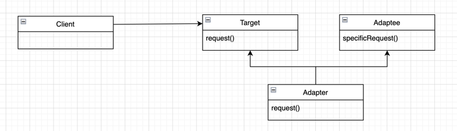
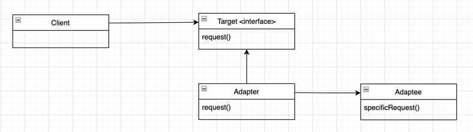
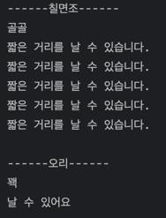

## 어댑터 패턴

> 특정 클래스 인터페이스를 클라이언트에서 요구하는 다른 인터페이스로 변환  
> 인터페이스가 호환되지 않아 같이 쓸 수 없었던 클래스 사용 가능

클래스 어댑터



객체 어댑터



이전의 전략 패턴에서 만들었던 `Duck`과 비슷한 `Turkey`가 생겼습니다.

---

### 구현

**Duck**
```java
public interface Duck {
	public void quack();
	public void fly();
}
```

**MallardDuck**

```java
public class MallardDuck implements Duck {
	@Override
	public void quack() {
		System.out.println("꽥");
	}

	@Override
	public void fly() {
		System.out.println("날 수 있어요");
	}
}
```

**Turkey**
```java
public interface Turkey {
	public void gobble();
	public void fly();
}
```

**WildTurkey**
```java
public class WildTurkey implements Turkey {
	@Override
	public void gobble() {
		System.out.println("골골");
	}

	@Override
	public void fly() {
		System.out.println("짧은 거리를 날 수 있습니다.");
	}
}
```

**TurkeyAdapter**
```java
public class TurkeyAdapter implements Duck {
	Turkey turkey;

	public TurkeyAdapter(Turkey turkey) {
		this.turkey = turkey;
	}

	@Override
	public void quack() {
		turkey.gobble();
	}

	@Override
	public void fly() {
		for (int i = 0; i < 5; i++) {
			turkey.fly();
		}
	}
}
```

**테스트 코드**
```java
public class Main {
	public static void main(String[] args) {
		Duck mallardDuck = new MallardDuck();

		Turkey turkey = new WildTurkey();
		Duck turkeyAdapter = new TurkeyAdapter(turkey);

		System.out.println("------칠면조------");
		turkeyAdapter.quack();
		turkeyAdapter.fly();
		System.out.println();
		System.out.println("------오리------");
		mallardDuck.quack();
		mallardDuck.fly();
	}
}
```

**결과**


<br></br>