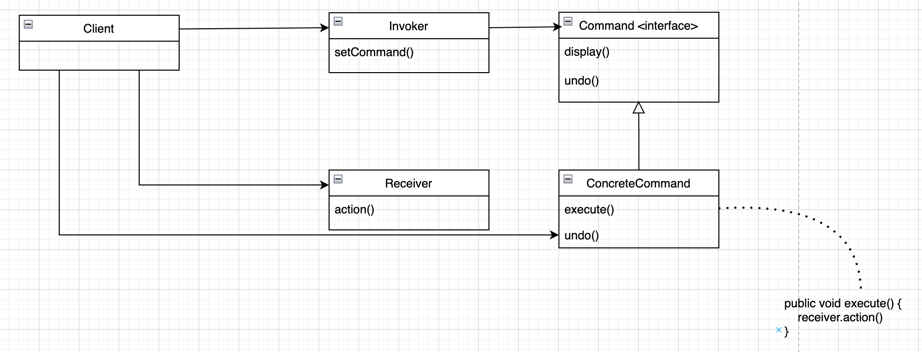
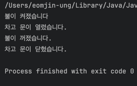

## 커맨드 패턴

> 일련의 행동을 특정 리시버와 연결함으로써 요청을 캡슐화한 것
> 명령으로 객체를 매개변수화할 수 있음



7개의 슬롯을 각각 `ON` 버튼과 `OFF` 버튼으로 제어 가능한 리모콘을 커맨더 패턴으로 만들어보려한다.

**음식 주문 과정**
1. 고객이 원하는 것 주문
2. 주문 내용으로 주문서가 구성
3. 종업원은 주문을 받음 
4. 종업원이 주방으로 주문을 전달
5. 주방장은 지시에 맞는 음식을 준비

### 구현

**Command**
```java
public interface Command {
	public void execute();
}
```

**조명 on 커맨드**
```java
public class LightOnCommand implements Command {
	Light light;

	public LightOnCommand(Light light) {
		this.light = light;
	}

	@Override
	public void execute() {
		light.on();
	}
}
```

**조명 off 커맨드**
```java
public class LightOffCommand implements Command {
	Light light;

	public LightOffCommand(Light light) {
		this.light = light;
	}

	@Override
	public void execute() {
		light.off();
	}
}
```

**리모콘**
```java
public class RemoteControl {
	Command[] onCommands;
	Command[] offCommands;

	public RemoteControl() {
		onCommands = new Command[7];
		offCommands = new Command[7];
	}

	public void setCommand(int slot, Command onCommand, Command offCommand) {
		onCommands[slot] = onCommand;
		offCommands[slot] = offCommand;
	}

	public void onButtonWasPushed(int slot) {
		onCommands[slot].execute();
	}

	public void offButtonWasPushed(int slot) {
		offCommands[slot].execute();
	}
}
```

**테스트 코드**
```java
public class Main {
	public static void main(String[] args) {
		RemoteControl remoteControl = new RemoteControl();
		Light light = new Light();
		LightOnCommand onLightOnCommand = new LightOnCommand(light);
		LightOffCommand offLightOnCommand = new LightOffCommand(light);
		GarageDoor garageDoor = new GarageDoor();
		GarageDoorOpenCommand onGarageDoor = new GarageDoorOpenCommand(garageDoor);
		GarageDoorCloseCommand offGarageDoor = new GarageDoorCloseCommand(garageDoor);

		remoteControl.setCommand(1, onLightOnCommand, offLightOnCommand);
		remoteControl.setCommand(4, onGarageDoor, offGarageDoor);

		remoteControl.onButtonWasPushed(1);
		remoteControl.onButtonWasPushed(4);
		remoteControl.offButtonWasPushed(1);
		remoteControl.offButtonWasPushed(4);
	}
}
```


**결과**


<br></br>