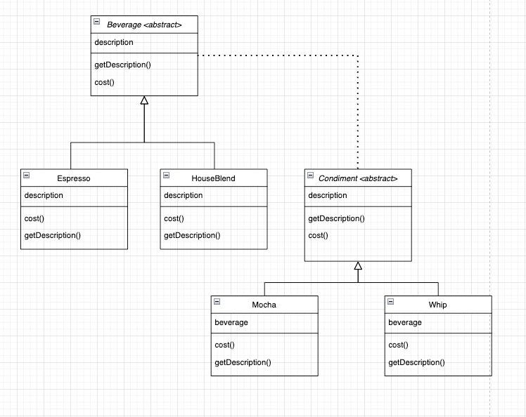
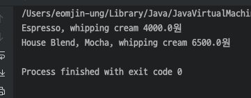

## 데코레이터 패턴

> 객체에 추가 요소를 동적으로 더할 수 있습니다. 데코레이터를 사용하면   
> 서브클래스를 만들 때보다 훨씬 유연하게 기능을 확장할 수 있습니다.

---

<br></br>

### Before


각각의 옵션을 단 메뉴들을 일일이 객체로 만들어주는 상황

<br></br>

---

<br></br>

### 디자인 패턴 적용 후



```java
public abstract class Beverage {    // 음료
	String description = "Unknown Beverage";

	public String getDescription() {
		return description;
	}

	public abstract double cost();
}


public class Espresso extends Beverage {

	public Espresso() {
		this.description = "Espresso";
	}

	@Override
	public String getDescription() {
		return "Espresso";
	}

	@Override
	public double cost() {
		return 3000;
	}
}
```

```java
public abstract class CondimentDecorator extends Beverage {     // 첨가물
	Beverage beverage;

	public abstract String getDescription();
}


public class Mocha extends CondimentDecorator {
	Beverage beverage;
	public Mocha(Beverage beverage) {
		this.beverage = beverage;
	}

	@Override
	public String getDescription() {
		return beverage.getDescription() + ", Mocha";
	}

	@Override
	public double cost() {
		return beverage.cost() + 1500;
	}
}
```

```java
Beverage espresso = new Espresso();
espresso = new Whip(espresso);
System.out.println(espresso.getDescription() + " " + espresso.cost() + "원");

Beverage beverage = new HouseBlend();
beverage = new  Mocha(beverage);
beverage = new Whip(beverage);
System.out.println(beverage.getDescription() + " " + beverage.cost() + "원");
```

