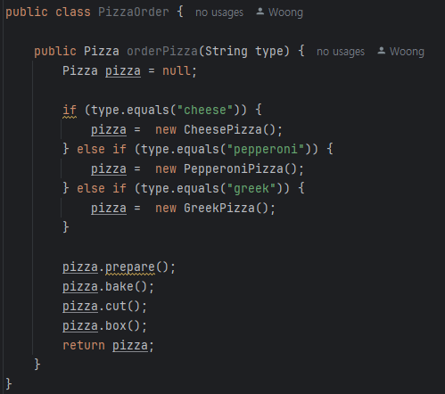
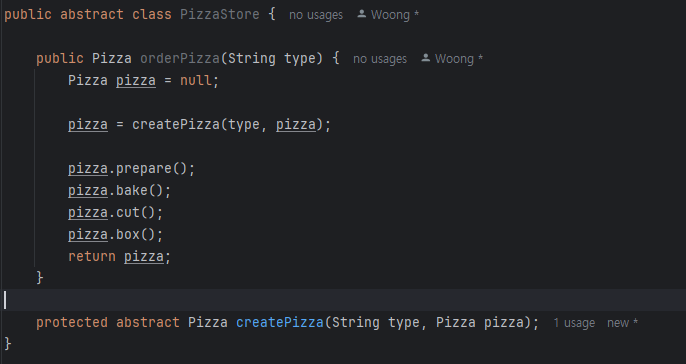
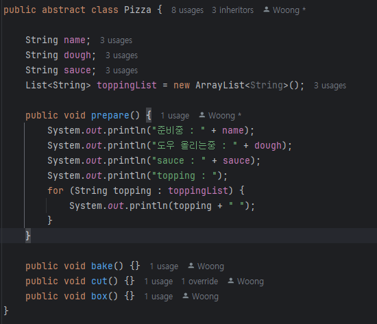
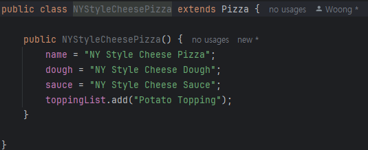
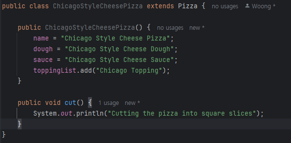

## 팩토리 패턴

> 간단한 팩토리는 디자인 패턴이라기 보다는 프로그래밍에 자주 쓰이는 관용구 

### 적용

피자 가게를 운영해 봅시다. 

다양한 종류의 피자

새로운 피자 출시에는 새로운 코드가 추가되야된다는 단점 존재

_**팩토리(캡슐화) 적용**_

  

---

  

## 팩토리 메소드 패턴

> 객체를 생성할 때 필요한 인터펭리스를 만듭니다. 어떤 클래스의 인스턴스를 만들지는 서브클래스에서 결정합니다. 팩토리 메소드 패턴을 사용하면 클래스 인스턴스를 만드는 일은 서브클래스에 맡깁니다.

  

### 적용

**다른 방식의 굽기, 치즈, 토핑 등 각 지점 적용 -> 추상 메소드 선언**

**지역별 피자 적용**

