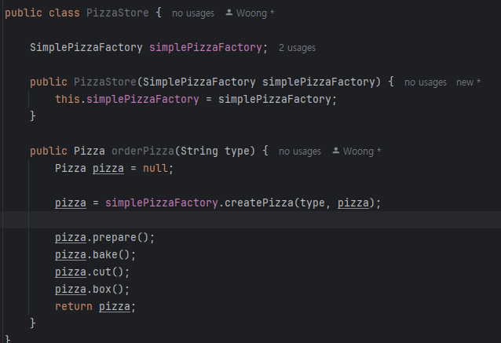
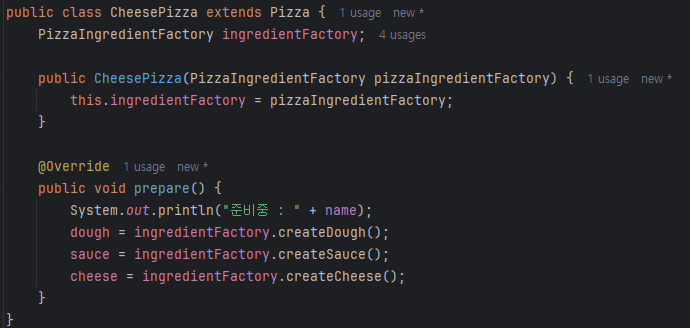

## 팩토리 패턴

> 간단한 팩토리는 디자인 패턴이라기 보다는 프로그래밍에 자주 쓰이는 관용구 
> (실제로 패턴은 아님)

피자 가게를 운영해 봅시다.

다양한 종류의 피자

새로운 피자 출시에는 새로운 코드가 추가되야된다는 단점 존재

### 구현

_**팩토리(캡슐화) 적용**_

  

---

  

## 팩토리 메소드 패턴

> 객체를 생성할 때 필요한 인터펭리스를 만듭니다. 어떤 클래스의 인스턴스를 만들지는 서브클래스에서 결정합니다. 팩토리 메소드 패턴을 사용하면 클래스 인스턴스를 만드는 일은 서브클래스에 맡깁니다.

  

### 적용

**다른 방식의 굽기, 치즈, 토핑 등 각 지점 적용 -> 추상 메소드 선언**

**지역별 피자 적용**

  

---

## 추상 팩토리 패턴

> 구상 클래스에 의존하지 않고도 서로 연관되거나 의존적인 객체로 이루어진 제품군을 생산하는 인터페이스를 제공합니다. 구상 클래스는 서브 클래스에서 만듭니다.

### 의존성 뒤집기 원칙

> **디자인 원칙 : 추상화된 것에 의존하게 만들고 구상 클래스에 의존하지 않게 만든다.**
> **PizzaStore**는 **고수준 구성 요소**, **피자 클래스**는 **저수준 구성 요소**
> **고수준 구성 요소는 저수준 구성 요소에 의해 정의되는 행동이 들어있는 구성 요소**

#### 의존성 뒤집기 원칙을 지키는 방법
> * 변수에 구상 클래스의 레퍼런스를 저장하지 않는다.
> * 구상 클래스에서 유도된 클래스를 만들지 않는다.
> * 베이스 클래스에 이미 구현되어 있는 메소드를 오버라이드 하지 않는다.

고수준 모듈과 저수준 모듈 모두 하나의 추상 클래스에 의존

### 구현

#### 팩토리 생성

#### 피자 클래스 수정

#### 결과

