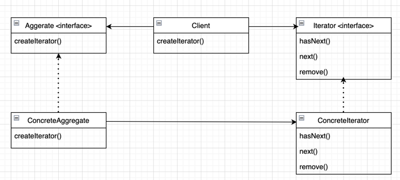
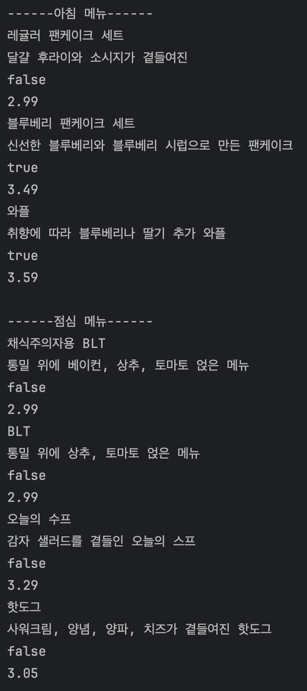

## 반복자 패턴

> **컬렉션의 구현 방법을 노출하지 않으면서 집합체 내의 모든 항목에 접근하는 방법을 제공**  



---

<br></br>

### 요구사항

두개의 식당이 합병하는데
한쪽은 메뉴를 `List`로 한쪽은 `Array`로 관리한다.
하지만 두 식당 모두 메뉴 코드를 건드리는 것을 반대한다.

각 메뉴에 반복자 패턴 인터페이스를 구현해보자.

<br></br>

### BEFORE

```java
public class PancakeHouseMenu {
	List<MenuItem> menuItemList;
	
	public PancakeHouseMenu() {
		menuItemList = new ArrayList<>();

		addItem("K&B 팬케이크 세트", "스크램블 에그와 토스트가 곁들여진 팬케이크", true, 2.99);
		addItem("레귤러 팬케이크 세트", "달걀 후라이와 소시지가 곁들여진", false, 2.99);
		addItem("블루베리 팬케이크 세트", "신선한 블루베리와 블루베리 시럽으로 만든 팬케이크", true, 3.49);
		addItem("와플", "취향에 따라 블루베리나 딸기 추가 와플", true, 3.59);
	}
	
	public void addItem(String name, String description,
		boolean vegetarian, double price) {
		MenuItem menuItem = new MenuItem(name, description, vegetarian, price);
		menuItemList.add(menuItem);
	}
	
	public List<MenuItem> getMenuItemList() {
		return menuItemList;
	}
}
```

```java
public class DinerMenu {
	static final int MAX_ITEMS = 6;
	int numberOfItems = 0;
	MenuItem[] menuItems;
	
	public DinerMenu() {
		menuItems = new MenuItem[MAX_ITEMS];

		addItem("채식주의자용 BLT", "통밀 위에 베이컨, 상추, 토마토 얹은 메뉴", false, 2.99);
		addItem("BLT", "통밀 위에 상추, 토마토 얹은 메뉴", false, 2.99);
		addItem("오늘의 수프", "감자 샐러드를 곁들인 오늘의 스프", false, 3.29);
		addItem("핫도그", "사워크림, 양념, 양파, 치즈가 곁들여진 핫도그", false, 3.05);
	}
	
	public void addItem(String itemName, String description,
		boolean vegan, double price) {
		MenuItem menuItem = new MenuItem(itemName, description, vegan, price);
		if (numberOfItems >= MAX_ITEMS) {
			System.out.println("메뉴가 꽉차서 더 추가할 수 없습니다.");
		} else {
			menuItems[numberOfItems] = menuItem;
			numberOfItems++;
		}
	}

	public MenuItem[] getMenuItems() {
		return menuItems;
	}
}
```

### 반복자 디자인 패턴 적용 후

```java
public interface Iterator {
	boolean hasNext();
	MenuItem next();
}
```

```java
public class DinerMenuIterator implements Iterator {
	MenuItem[] menuItems;
	int position = 0;
	
	public DinerMenuIterator(MenuItem[] menuItems) {
		this.menuItems = menuItems;	
	}

	@Override
	public boolean hasNext() {
		return position < menuItems.length && menuItems[position] != null;
	}

	@Override
	public MenuItem next() {
		MenuItem menuItem = menuItems[position];
		position = position + 1;
		return menuItem;
	}
}
```

```java
public class DinerMenu {
	static final int MAX_ITEMS = 6;
	int numberOfItems = 0;
	MenuItem[] menuItems;
	
	public DinerMenu() {
		menuItems = new MenuItem[MAX_ITEMS];

		addItem("채식주의자용 BLT", "통밀 위에 베이컨, 상추, 토마토 얹은 메뉴", false, 2.99);
		addItem("BLT", "통밀 위에 상추, 토마토 얹은 메뉴", false, 2.99);
		addItem("오늘의 수프", "감자 샐러드를 곁들인 오늘의 스프", false, 3.29);
		addItem("핫도그", "사워크림, 양념, 양파, 치즈가 곁들여진 핫도그", false, 3.05);
	}
	
	public void addItem(String itemName, String description,
		boolean vegan, double price) {
		MenuItem menuItem = new MenuItem(itemName, description, vegan, price);
		if (numberOfItems >= MAX_ITEMS) {
			System.out.println("메뉴가 꽉차서 더 추가할 수 없습니다.");
		} else {
			menuItems[numberOfItems] = menuItem;
			numberOfItems++;
		}
	}

	// public MenuItem[] getMenuItems() {
	// 	return menuItems;
	// }
	
	public Iterator createIterator() {
		return new DinerMenuIterator(menuItems);
	}
}
```

```java
public class Waitress {
	PancakeHouseMenu pancakeHouseMenu;
	DinerMenu dinerMenu;

	public Waitress(PancakeHouseMenu pancakeHouseMenu, DinerMenu dinerMenu) {
		this.pancakeHouseMenu = pancakeHouseMenu;
		this.dinerMenu = dinerMenu;
	}
	
	public void printMenu() {
		Iterator pancakeHouseMenuIterator = pancakeHouseMenu.createIterator();
		Iterator dinerMenuIterator = dinerMenu.createIterator();

		System.out.println("------아침 메뉴------");
		printMenu(pancakeHouseMenuIterator);
		System.out.println("------점심 메뉴------");
		printMenu(dinerMenuIterator);
	}
	
	private void printMenu(Iterator menuIterator) {
		while (menuIterator.hasNext()) {
			MenuItem menuItem = menuIterator.next();
			System.out.println(menuItem.getName());
			System.out.println(menuItem.getDescription());
			System.out.println(menuItem.getVegetarian());
			System.out.println(menuItem.getPrice());
		}
	}
}
```

### 테스트

```java
public class Main {
	public static void main(String[] args) {
		PancakeHouseMenu pancakeHouseMenu = new PancakeHouseMenu();
		DinerMenu dinerMenu = new DinerMenu();

		Waitress waitress = new Waitress(pancakeHouseMenu, dinerMenu);
		waitress.printMenu();
	}
}
```

결과


<br></br>

---

### 단일 역할 원칙

* 어떤 클래스가 바뀌는 이유는 하나뿐이어야한다.