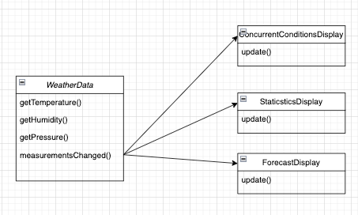
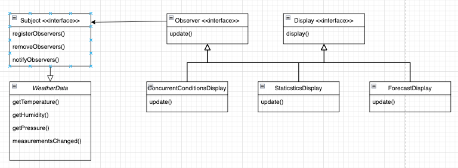
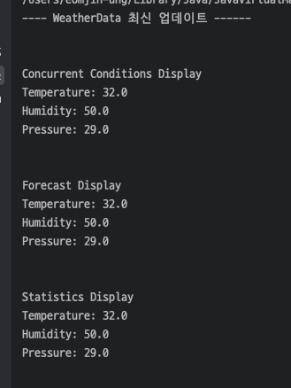

## 옵저버 패턴

> **신문사 + 구독자 = 옵저버 패턴**  
> (신문사는 주제, 구독자는 옵저버)   
> _주제에서는 중요한 데이터를 관리하는데 데이터가 바뀌면 옵저버들에게 그 소식이 전달됩니다._
>
> 한 객체의 상태가 바뀌면 그 객체에 의존하는 다른 객체에게 연락이 가고 자동으로 내용이 갱신되는 방식으로 일대다 의존성을 정의


---

<br></br>

### Before



`WeaterData`는 온도, 습도, 기압 기상 관측값이 갱신될 때마다 `measurementsChanged()`
메소드를 호출해서 다른 인스턴스에 업데이트 해줍니다.   

<br></br>

```java
public void measurementsChanged() {
	float temperature = getTemperature();
	float humidity = getHumidity();
	float pressure = getPressure();

	concurrentConditionsDisplay.update(temperature, humidity, pressure);
	statisticsDisplay.update(temperature, humidity, pressure);
	forecastDisplay.update(temperature, humidity, pressure);
}
```

<br></br>

### 디자인 패턴 적용 후



```java
public class WeatherData implements Subject {

	List<Observer> observers = new ArrayList<>();
	float temperature;
	float humidity;
	float pressure;

	public WeatherData() {}

	public float getTemperature() {
		return 32;
	}

	public float getHumidity() {
		return 50;
	}

	public float getPressure() {
		return 29;
	}

	@Override
	public void registerObserver(Observer observer) {
		observers.add(observer);
	}

	@Override
	public void removeObserver(Observer observer) {
		observers.remove(observer);
	}

	@Override
	public void notifyObservers() {
		for (Observer observer : observers) {
			observer.update(temperature, humidity, pressure);
		}
	}

	public void measurementsChanged() {
		notifyObservers();
	}

	public void setMeasurements() {
		this.temperature = getTemperature();
		this.humidity = getHumidity();
		this.pressure = getPressure();
		System.out.println();
		measurementsChanged();
	}
}
```

```java
public class ForecastDisplay implements Observer, Display {
	public float temperature;
	public float humidity;
	public float pressure;

	public ForecastDisplay() {
	}

	@Override
	public void update(float temperature, float humidity, float pressure) {
		this.temperature = temperature;
		this.humidity = humidity;
		this.pressure = pressure;
		display();
	}

	@Override
	public void display() {
		System.out.println();
		System.out.println("Forecast Display");
		System.out.println("Temperature: " + temperature);
		System.out.println("Humidity: " + humidity);
		System.out.println("Pressure: " + pressure);
		System.out.println();
	}
}

```

