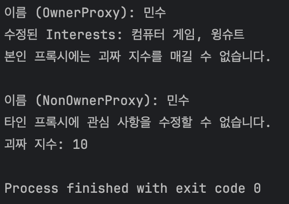

## 프록시 패턴

> 특정 객체로의 접근을 제어하는 대리인을 제공합니다.

> 프록시 패턴을 사용하면 원격 객체라든가 생성하기 힘든 객체, 보안이 중요한 객체와 같은 다른 객체로의 접근을 제어하는 대리인 객체를 만들 수 있습니다.


---

<br></br>

### 요구사항
마을 사람들의 제 착을 찾아주는 데이팅 서비스를 만들려고 합니다.
상대방의 ***괴짜 지수***를 매기는 기능을 더하려고 합니다.
**누군가가 타인의 관심 사항을 바꾸고, 본인의 자기 선호도 점수를 조작하는걸 막아주세요**

<br></br>

### BEFORE

```java
public interface Person {

	String getName();
	String getGender();
	String getInterests();
	int getGeekRating();

	void setName(String name);
	void setGender(String gender);
	void setInterests(String interests);
	void setGeekRating(int geekRating);
}

```

```java
public class PersonImpl implements Person {

	String name;
	String gender;
	String interests;
	int rating;
	int ratingCount = 0;

	@Override
	public String getName() {
		return name;
	}

	@Override
	public String getGender() {
		return gender;
	}

	@Override
	public String getInterests() {
		return interests;
	}

	@Override
	public int getGeekRating() {
		if (ratingCount == 0) return 0;
		return rating/ratingCount;
	}

	@Override
	public void setName(String name) {
		this.name = name;
	}

	@Override
	public void setGender(String gender) {
		this.gender = gender;
	}

	@Override
	public void setInterests(String interests) {
		this.interests = interests;
	}

	@Override
	public void setGeekRating(int geekRating) {
		this.rating += geekRating;
		ratingCount++;
	}
}
```

Person 인터페이스용 동적 프록시를 만들어보자

**프록시로 해결할 문제**를 정리해보면
>1. 자기 괴짜 지수를 직접 조작할 수 없어야 한다.
>2. 다른 사람들의 개인정보를 수정할 수 없어야 한다.

두가지 프록시를 만들어보자
하나는 **자신의 객체에 접근하는 프록시**, 하나는 **다른 객체에 접근하는 프록시**

```java
public class OwnerInvocationHandler implements InvocationHandler {
	private Person person;

	public OwnerInvocationHandler(Person person) {
		this.person = person;
	}

	@Override
	public Object invoke(Object proxy, Method method, Object[] args) throws Throwable {
		if (method.getName().startsWith("get")) {
			return method.invoke(person, args);
		} else if (method.getName().equals("setGeekRating")) {
			throw new IllegalAccessException("You cannot rate yourself!");
		} else if (method.getName().startsWith("set")) {
			return method.invoke(person, args);
		}
		return null;
	}
}
```

```java
public class NonOwnerInvocationHandler implements InvocationHandler {
	private Person person;

	public NonOwnerInvocationHandler(Person person) {
		this.person = person;
	}

	@Override
	public Object invoke(Object proxy, Method method, Object[] args) throws Throwable {
		if (method.getName().startsWith("get")) {
			return method.invoke(person, args);
		} else if (method.getName().equals("setGeekRating")) {
			return method.invoke(person, args);
		} else if (method.getName().startsWith("set")) {
			throw new IllegalAccessException("You cannot modify someone else's personal information!");
		}
		return null;
	}
}
```

```java
package proxy;

import java.lang.reflect.Proxy;

public class ProxyFactory {
	public static Person getOwnerProxy(Person person) {
		return (Person) Proxy.newProxyInstance(
			person.getClass().getClassLoader(),
			person.getClass().getInterfaces(),
			new OwnerInvocationHandler(person)
		);
	}

	public static Person getNonOwnerProxy(Person person) {
		return (Person) Proxy.newProxyInstance(
			person.getClass().getClassLoader(),
			person.getClass().getInterfaces(),
			new NonOwnerInvocationHandler(person)
		);
	}
}
```

**테스트**
```java
public class Main {
	public static void main(String[] args) {
		PersonImpl joe = new PersonImpl();
		joe.setName("민수");
		joe.setGender("남");
		joe.setInterests("프로그래밍, 맛집 탐방");

		// 본인 프록시 생성
		Person ownerProxy = ProxyFactory.getOwnerProxy(joe);
		System.out.println("이름 (OwnerProxy): " + ownerProxy.getName());

		ownerProxy.setInterests("컴퓨터 게임, 윙슈트");
		System.out.println("수정된 Interests: " + ownerProxy.getInterests());

		try {
			ownerProxy.setGeekRating(5); // 본인은 본인의 괴짜 지수를 설정할 수 없음
		} catch (Exception e) {
			System.out.println("본인 프록시에는 괴짜 지수를 매길 수 없습니다.");
		}

		// 다른 사람이 접근하는 프록시 생성
		System.out.println();
		Person nonOwnerProxy = ProxyFactory.getNonOwnerProxy(joe);
		System.out.println("이름 (NonOwnerProxy): " + nonOwnerProxy.getName());

		try {
			nonOwnerProxy.setInterests("등산"); // 다른 사람의 개인정보 변경 불가
		} catch (Exception e) {
			System.out.println("타인 프록시에 관심 사항을 수정할 수 없습니다.");
		}

		nonOwnerProxy.setGeekRating(10); // 다른 사람이 괴짜 지수 평가 가능
		System.out.println("괴짜 지수: " + joe.getGeekRating());
	}
}
```

**결과**



<br></br>
