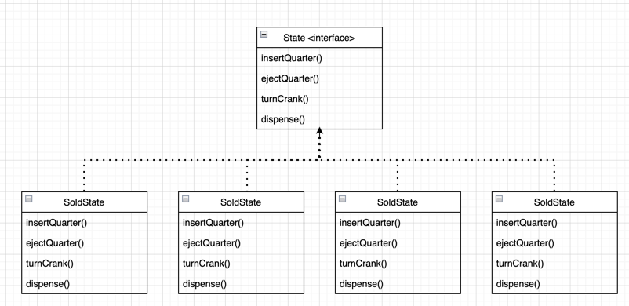

## 상태 패턴

> 객체의 내부 상태가 바뀜에 따라서 객체의 행동을 바꿀 수 있습니다.
> 마치 객체의 클래스가 바뀌는 것과 같은 결과를 얻을 수 있습니다.



---

<br></br>

### 요구사항
예전에 요구사항으로 만들어 둔 동전 뽑기 기계에서
10분의 1 확률로 두개가 뽑힐 수 있게 만들어 달라는 요청

기존의 코드를 보면

<br></br>

### BEFORE

```java
public class GumballMachine {
	
	final static int SOLD_OUT = 0;
	final static int NO_QUARTER = 1;
	final static int HAS_QUARTER = 2;
	final static int SOLD = 3;
	
	int state = SOLD_OUT;
	int count = 0;

	public GumballMachine(int count) {
		this.count = count;
		if (count > 0) {
			state = NO_QUARTER;
		}
	}
	
	public void insertQuarter() {
		if (state == HAS_QUARTER) {
			// ...
		} else if (state == SOLD) {
			// ...
		} else if (state == NO_QUARTER) {
			// ...
		} else if (state == SOLD_OUT) {
			// ...
		}
	}

	public void ejectQuarter() {
		if (state == HAS_QUARTER) {
			// ...
		} else if (state == SOLD) {
			// ...
		} else if (state == NO_QUARTER) {
			// ...
		} else if (state == SOLD_OUT) {
			// ...
		}
	}

	public void turnCrank() {
		if (state == HAS_QUARTER) {
			// ...
		} else if (state == SOLD) {
			// ...
		} else if (state == NO_QUARTER) {
			// ...
		} else if (state == SOLD_OUT) {
			// ...
		}
	}

	public void dispense() {
		if (state == HAS_QUARTER) {
			// ...
		} else if (state == SOLD) {
			// ...
		} else if (state == NO_QUARTER) {
			// ...
		} else if (state == SOLD_OUT) {
			// ...
		}
	}
}
```

각 상황별로 모든 상태에 따른 조건 처리를해서 구현한 이전 코드

**상태 패턴으로 리팩토링**

```java
public interface State {
	void insertQuarter();
	void ejectQuarter();
	void turnCrank();
	void dispense();
}
```

```java
public class NoQuarterState implements State {
	GumballMachine gumballMachine;

	public NoQuarterState(GumballMachine gumballMachine) {
		this.gumballMachine = gumballMachine;
	}

	@Override
	public void insertQuarter() {
		System.out.println("동전을 넣으셨습니다.");
		gumballMachine.setState(gumballMachine.getHasQuarterState());
	}

	@Override
	public void ejectQuarter() {
		System.out.println("동전을 넣어주세요.");
	}

	@Override
	public void turnCrank() {
		System.out.println("동전을 넣어주세요.");
	}

	@Override
	public void dispense() {
		System.out.println("동전을 넣어주세요.");
	}
}
```

`GumballMachine` 수정
```java
public class GumballMachine {

	State soldOutState;
	State noQuarterState;
	State hasQuarterState;
	State soldState;
	State winnerState;

	State state;
	int count = 0;

	public GumballMachine(int numberGumballs) {
		this.soldOutState = new SoldOutState(this);
		this.noQuarterState = new NoQuarterState(this);
		this.hasQuarterState = new HasQuarterState(this);
		this.soldState = new SoldState(this);

		this.count = numberGumballs;
		if (numberGumballs > 0) {
			state = noQuarterState;
		} else {
			state = soldOutState;
		}
	}

	public void insertQuarter() {
		state.insertQuarter();
	}

	public void ejectQuarter() {
		state.ejectQuarter();
	}

	public void turnCrank() {
		state.turnCrank();
		state.dispense();
	}

	void setState(State state) {
		this.state = state;
	}

	void releaseBall() {
		System.out.println("알맹이를 내보내고 있습니다.");
		if (count > 0) {
			count = count - 1;
		}
	}

	public State getSoldOutState() {
		return soldOutState;
	}

	public void setSoldOutState(State soldOutState) {
		this.soldOutState = soldOutState;
	}

	public State getNoQuarterState() {
		return noQuarterState;
	}

	public void setNoQuarterState(State noQuarterState) {
		this.noQuarterState = noQuarterState;
	}

	public State getHasQuarterState() {
		return hasQuarterState;
	}

	public void setHasQuarterState(State hasQuarterState) {
		this.hasQuarterState = hasQuarterState;
	}

	public State getSoldState() {
		return soldState;
	}

	public void setSoldState(State soldState) {
		this.soldState = soldState;
	}

	public int getCount() {
		return count;
	}
}
```


<br></br>
