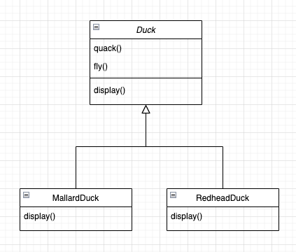
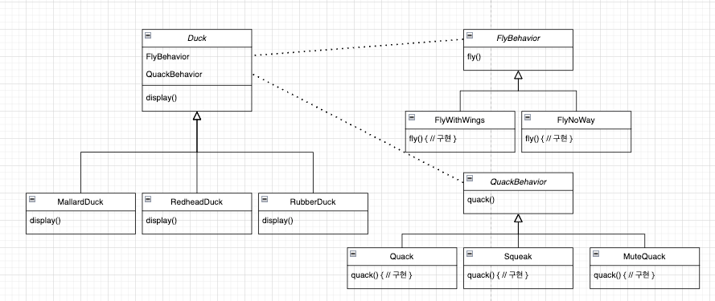
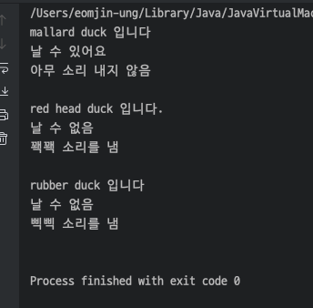

## 전략 패턴

> 알고리즘 군을 정의하고 **캡슐화**해서 각각의 알고리즘 군을 수정해서 쓸 수 있게 해줍니다. 전략 패턴을 사용하면 클라이언트로부터 알고리즘을 분리해서 독립적으로 변경할 수 있습니다.


### Before
 
 
새로운 Duck과 기존의 Duck의 꽥꽥 소리와 나는 기능을 각기 다르게 적용하고 싶은데
기존 `Duck`의 서브클래스는 같은 꽥 소리를 내고, 똑같이 날 수 밖에 없습니다.

<br></br>

### 요구사항

> MallardDuck : quack() X, fly() O  
> ReadHeadDuck : quack() O, fly() X    
> RubberDuck : quack() O (삐삐 소리 내야함), fly() X

<br></br>

### 디자인 패턴 적용 후



ex)
```java
public class MallardDuck extends Duck {

	public MallardDuck() {
		quackBehavior = new MuteQuack();
		flyBehavior = new FlyWithWings();
	}

	@Override
	public void display() {
		System.out.println("mallard duck 입니다");
		introduce();
	}
}
```

<br></br>


