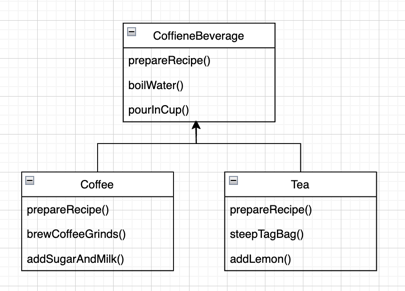

## 템플릿 메소드 패턴

> 알고리즘의 일부 단계를 서브클래스에서 구현  
> 알고리즘 구조는 그대로 유지, 특정 단계의 서브클래스 재정의

커피와 차를 묶어서 관리해보려 한다.



---

## 구현

### BEFORE

**커피**
```java
public class Coffee {

	void prepareRecipe() {
		boilWater();
		brewCoffeeGrinds();     // 차와 다름
		pourInCup();
		addSugarAndMilk();      // 차와 다름
	}

	public void boilWater() {
		System.out.println("물 끓이는 중");
	}

	public void brewCoffeeGrinds() {
		System.out.println("필터로 커피를 우려내는 중");
	}

	public void pourInCup() {
		System.out.println("컵에 따르는중");
	}

	public void addSugarAndMilk() {
		System.out.println("설탕과 우유를 추가");
	}
}
```

**차**
```java
public class Tea {
	
	void prepareRecipe() {
		boilWater();
		steepTeaBag();      // 커피와 다름
		pourInCup();
		addLemon();         // 커피와 다름
	}

	public void boilWater() {
		System.out.println("물 끓이는 중");
	}

	public void steepTeaBag() {
		System.out.println("찻잎을 우러내는 중");
	}

	public void addLemon() {
		System.out.println("레몬 추가");
	}

	public void pourInCup() {
		System.out.println("컵에 따르는중");
	}
}
```

<br></br>

### AFTER

**템플릿**
```java
public abstract class CaffeineBeverage {

	final void prepareRecipe() {
		boilWater();
		brew();
		pourInCup();
		addCondiments();
	}

	abstract void brew();

	abstract void addCondiments();

	public void boilWater() {
		System.out.println("물 끓이는 중");
	}

	public void pourInCup() {
		System.out.println("컵에 따르는중");
	}
}
```

**커피**
```java
public class Coffee extends CaffeineBeverage {

	void brew() {
		System.out.println("필터로 커피 우려내는 중");
	}

	void addCondiments() {
		System.out.println("설탕과 우유 추가");
	}
}
```

**차**
```java
public class Tea extends CaffeineBeverage {

	public void brew() {
		System.out.println("찻잎을 우러내는 중");
	}

	public void addCondiments() {
		System.out.println("레몬 추가");
	}
}
```
